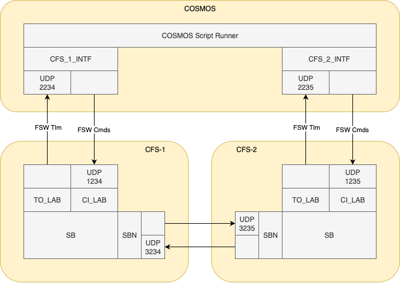
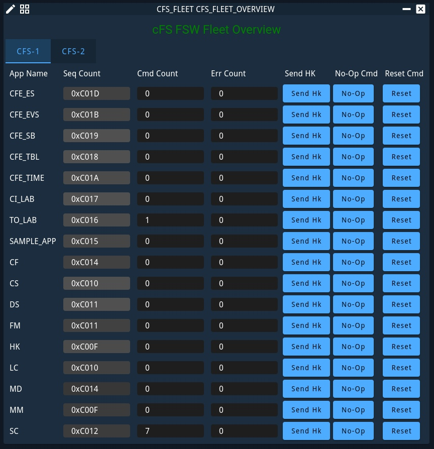

# NASA OpenC3 COSMOS cFS Plugin

This NASA OpenC3 COSMOS plugin is used to control and test the core Flight System (cFS) Flight Software (FSW).
See the [NASA/cFS](https://github.com/nasa/cfs) documentation for all things cFS.
See the [OpenC3](https://openc3.com) documentation for all things OpenC3.

## Introduction and Assumptions

With this plugin, you can:

- Build and send commands to cFS
- Receive and view telemtry from cFS
- Run test suites for functional demonstration of the cFS

This plugin assumes two instances of the cFS are running (target names: `CFS-1` and `CFS-2`),
and that COSMOS is connected to these instances via UDP.

- `CFS-1` command / telemetry interface
   - receives commands from COSMOS on UDP port: `1234`
   - delivers telemetry to COSMOS on UDP port: `2234`
- `CFS-2` command / telemetry interface
   - receives commands from COSMOS on UDP port: `1235`
   - delivers telemetry to COSMOS on UDP port: `2235`

The diagram below illustrates this expected network configuration.



Within each instance of the `CFS` target (`CFS-1` and `CFS-2`) are:

- command and telemetry packet defintions
- telemetry screens for overviews of live telemetry
- a functional test suite (named `cfs_test_suite`)
   - this is used to dempnstrate functionality of a single instance of the cFS (`CFS-1` or `CFS-2`)


Additionally, there is a `CFS_FLEET` target that includes:

- command and telemetry overview screens
- a functional test suite (named `cfs_fleet_test_suite`)
   - this is used to demonstrate functionality of two instances of cFS (`CFS-1` and `CFS-2` together)


## Setup

This section outlines the basic setup steps for getting OpenC3 COSMOS running.
In general, the OpenC3 COSMOS flow looks like this:

1. Setup and Start OpenC3 COSMOS
2. Build the NASA OpenC3 COSMOS Plugin
3. Install the Plugin into OpenC3 COSMOS


### Setup and Start OpenC3 COSMOS

This is necessary before you can build the NASA OpenC3 cFS COSMOS plugin.

- Install the [OpenC3 COSMOS Project](https://github.com/OpenC3/cosmos-project) using their instructions.
- Update COSMOS Default Configs
   - Configure UDP ports for COSMOS to receive telemetry from cFS
      - To do this, add the `ports` field (shown below) to the `openc3-operator` service in `cosmos-project/compose.yaml`.
         ```
         openc3-operator:
            ports:
               - "127.0.0.1:2234:2234/udp"
               - "127.0.0.1:2235:2235/udp"
         ```
      - Note that, if OpenC3 COSMOS was already running, it must be restarted for these changes to take affect.
- Start OpenC3 COSMOS (see OpenC3's documentation)


### Build the NASA OpenC3 COSMOS Plugin


#### Recommended method

This version now includes a Makefile to simplify creation of the gem file.  This is the preferred method to build
the gem going forward, as it combines the local scripts with scripts provided in the various submodules, allowing
more scripts to be included.

To build, simply run:

`make gem`

By default, this will build the gem corresponding to the `native_std` build configuration, and set the gem version
based on the most recent git tag.  This also adds an incrementing count each time the gem is re-built.  Other build
configurations can be referenced by setting the `O` variable when running make, for example:

`make gem O=/path/to/any/cfs/build`

The directory specified only needs to have the `prep` step performed, it does not need to be a complete build.

The version can also be directly specified by setting the PLUGIN_VERSION variable, such as:

`make gem PLUGIN_VERSION=X.Y.Z`

Note: If `openc3.sh` is not in the PATH, then the gem source will still be staged, but the binary file
will not be created.  In this case the gem binary can be created by manually running the tool in the staging
directory.

The resulting gem file is produced in `<build>/cosmos/plugin` where `<build>` refers to the build directory
specified via `O` (or native_std, if O was not specified).

#### Local-only method

This still supports building the gem directly using the `openc3.sh` script.  This is to preserve compatibility
with existing workflows that build the gem using this method.  However, when building with this method, the gem
will only include test scripts provided directly in this submodule; it will not contain tests from other
submodules.

With OpenC3 COSMOS running, and `openc3.sh` in your PATH, the plugin can be build using the following command:

`openc3.sh cli rake build VERSION=X.Y.Z`

Notes:

- Use `openc3.bat` for Windows
- VERSION is required (example: `VERSION=1.2.3`)
- gem file will be built locally


### Install the Plugin into OpenC3 COSMOS

Navigate to `http://localhost:2900` in a web browser to access the OpenC3 COSMOS UI.

1. Go to the OpenC3 Admin Tool, Plugins Tab
1. Click the paperclip icon and choose your plugin.gem file
1. Fill out the plugin parameters:
   * `cfs_eds_enabled`
      - Default: `false`
      - If running FSW built with EDS enabled, use `true`
   * `cfs_mem_addr_size`
      - Default: `64`
      - If running a 32-bit system, use `32`
   * `cfs_endianness`
      - Default: `LITTLE_ENDIAN`
      - If running on a big endian system, use `BIG_ENDIAN`
      - If running FSW built with EDS enabled, use `BIG_ENDIAN`
   * `cfs_1_intf_ip` and `cfs_2_intf_ip`:
      - Default: `172.17.0.1`
            - This should match the IP address listed for the default docker network bridge (`docker0`)
            - You can use the following to find this info:
               `ifconfig docker0 | grep "inet " | awk '{print $2}'`
      - This field should match the IP address COSMOS should connect to
            when reading/writing to the FSW command/telemetry streams
   * `global_tlm_output_ip`:
      - Default: `127.0.0.1`
      - This should match the IP address that cFS should send telemetry to
      - This is often used in the Telemetry Output Enable command
1. Click "Install"


## Using the Plugin

This section describes common ways users interact with the cFS with this plugin.


### Enable cFS Telemetry

Using the browser / OpenC3 COSMOS UI, enable telemetry.

1. Open the Command Sender
1. From the "Select Target" dropdown, select the CFS target (`CFS-1` or `CFS-2`).
1. From the "Select Packet" dropdown, select the TO Enable Output command (`TO_LAB_CMD_ENABLE_OUTPUT`).

From this "Command Sender" page, many other cFS commands can be built and sent.

Once this `TO_LAB_CMD_ENABLE_OUTPUT` command is sent,
the cFS bundle should start transmitting requested telemetry data from the cFS apps to COSMOS.
See the next section, "View cFS Telemetry", to confirm the command succeeded.


### View cFS Telemetry

Using the browser / COSMOS UI, open the relevant telemetry screens.

1. Open the Telemetry Viewer
1. From the "Select Target" drop-down, select the `CFS_FLEET` target
1. From the "Select Screen" drop-down, select the `CFS_FLEET_OVERVIEW` telmetry screen

This `CFS_FLEET_OVERVIEW` screen (screenshot shown below) displays
an overview of the housekeeping telemetry flowing from each cFS instance.

There are also buttons to send simple commands to each cFS application:

- `Send Hk` - requests a new housekeeping packet from the cFS app
- `No-Op` - sends a "no-operation" command, which should increment the cFS app's Command Count
- `Reset` - sends a "reset counters" command, which should clear the counters for the cFS app



Additionally, each cFS target (`CFS-1` and `CFS-2`) includes housekeeping telemetry screens.


### cFS Test Suite (One Instance of cFS)

This `cfs_test_suite`, found within the `procedures` directory of the `CFS-1` and `CFS-2` targets,
includes functional tests to exercise features of a single cFS instance.

To run this test:

1. Open the Script Runner
1. Open the file:
    - `CFS-1` or `CFS-2` > `procedures` > `cfs_test_suite.py`
1. Click the "Start" button, to the right of the "Suite" drop-down


### cFS Fleet Test Suite (Two Instances of cFS)

This `cfs_fleet_test_suite`, found within the `procedures` directory of the `CFS_FLEET` target,
includes functional tests to exercise features that require multiple cFS instances.

To run this test:

1. Open the Script Runner
1. Open the file:
    - `CFS_FLEET` > `procedures` > `cfs_fleet_test_suite.py`
1. Click the "Start" button, to the right of the "Suite" drop-down


## Contributing

We encourage you to contribute to both cFS and OpenC3!

Contributing is easy.

1. Fork the project
2. Create a feature branch
3. Make your changes
4. Submit a pull request

Before any contributions can be incorporated we do require all contributors to agree to a Contributor License Agreement.
This protects both you and us and you retain full rights to any code you write.


## License

This NASA OpenC3 COSMOS cFS plugin is released under the Apache 2.0 License.
See [LICENSE.txt](LICENSE.txt)
